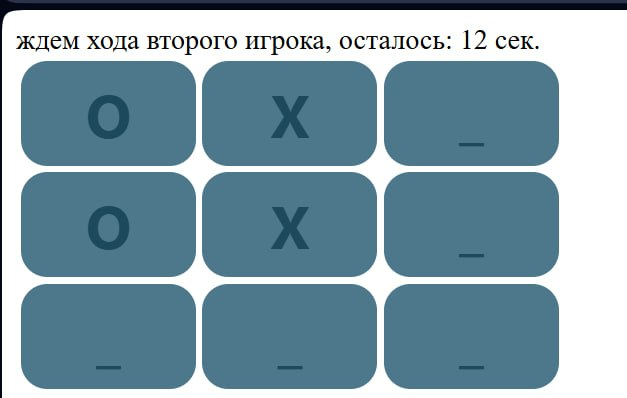
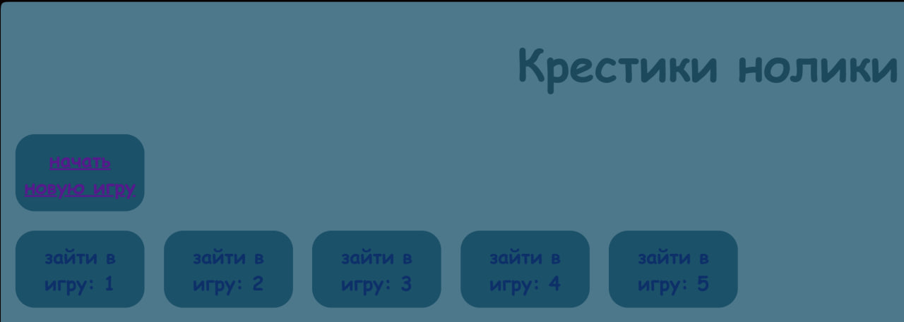
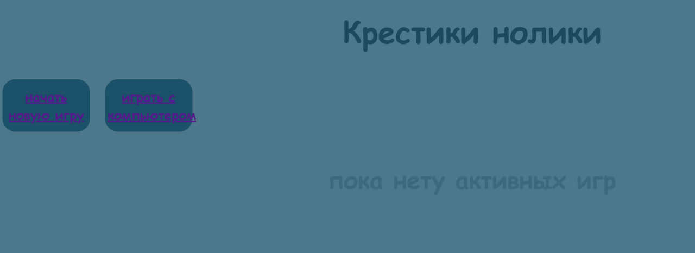

# tic-tac-toe :]

## Commands for downloading libraries:

1. pip install flask

2. pip install flask_session
### Gameplay screenshots

+ This is my first website, so there might be errors and the code might be a bit of a hack job.